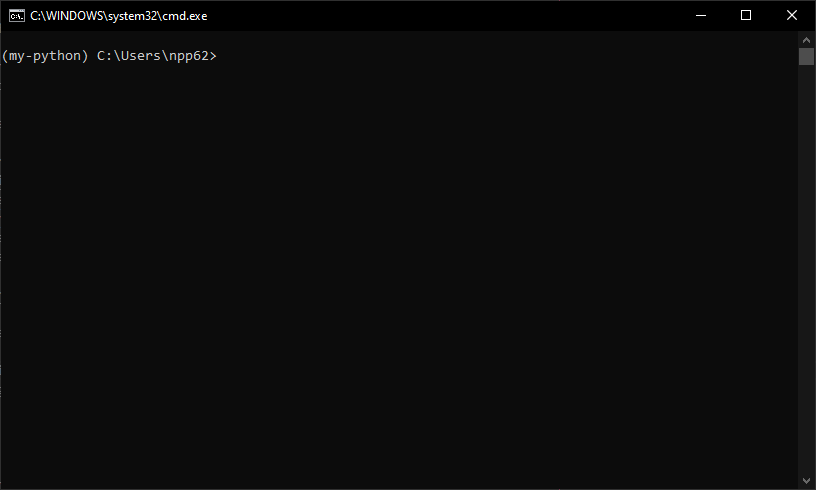
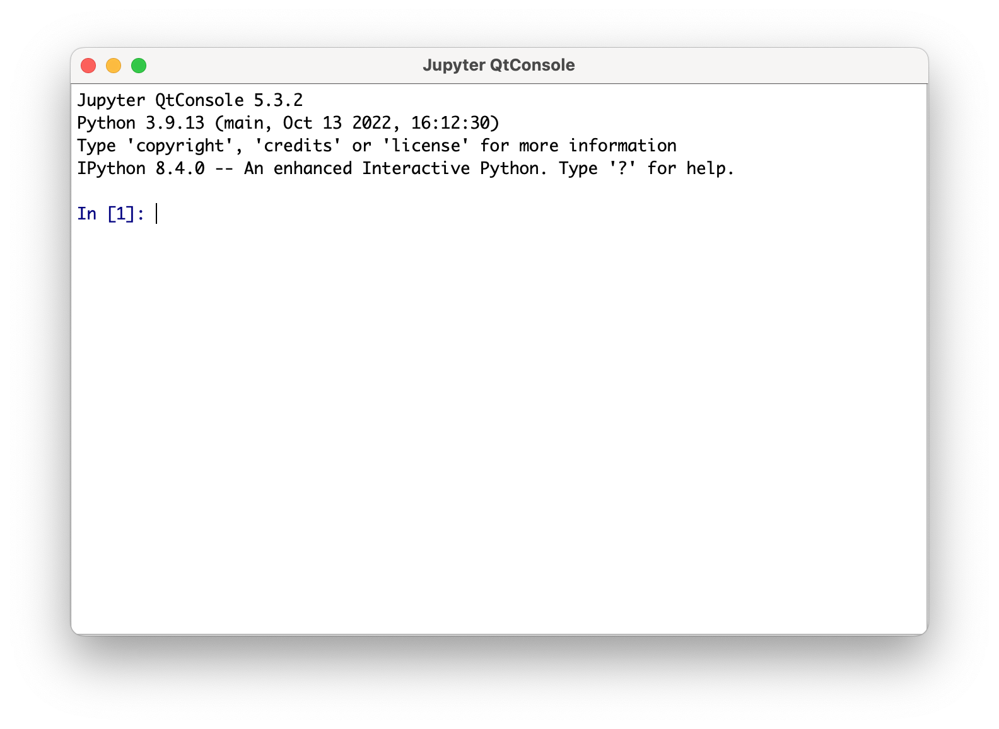
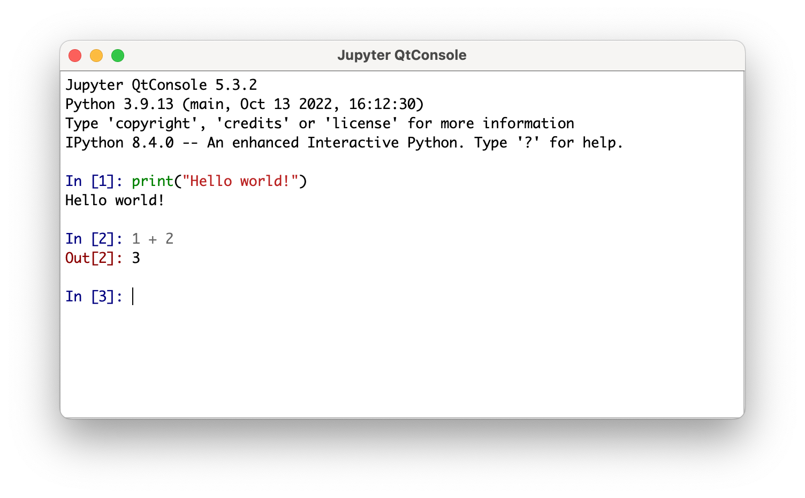

# Block 1 Part 1- Environment Setup

Welcome to part 1 of this session. Our goal is to setup Python so that we can get started with
Python coding.

Environment setup has traditionally been a major pain-point for Python beginners. Nowadays there are
tools that make setting up much easier, and allow you to start writing code with just a few clicks,
regardless of which Operating System and hardware you are using. One such tool,
[Anaconda](https://www.anaconda.com/), is particularly popular among data scientists.

Anaconda is an open-source [Python distribution]((https://wiki.python.org/moin/PythonDistributions))
platform. Besides providing the Python executable itself, Anaconda also includes
[Conda](https://conda.io/en/latest/) - an open-source source package manager and environment manager
for python projects. Conda makes it much easier to build and manage Python projects for scientific
research. For users less accustomed to the command-line, Anaconda also provides a graphical user
interface for conda, named [Anaconda
Navigator](https://docs.anaconda.com/navigator/getting-started/). We will primarily use Anaconda
Navigator throughout this course (though using conda via the console is fine too).

---
## Table of Contents

In this section you will:

- [Install Anaconda](#install-anaconda) (if using you're using your own computer)
- [Open Anaconda Navigator](#open-anaconda-navigator)
- [Import our Anaconda environment](#import-our-anaconda-environment)
- [Load the environment and run python](#load-the-environment-and-run-python)
    - [Non-interactively: terminal + text editor](#non-interactively-terminal--text-editor)
    - [Interactively: Using IPython shell](#interactively-using-ipython-shell)

---

## Install Anaconda

- School computer - If you're on a school computer, then Anaconda should be available .
- Personal computer - If you're using you're personal computer, download the
  [installer](https://docs.anaconda.com/free/anaconda/install/) and follow the instructions on screen.

## Open Anaconda Navigator

Once Anaconda has been successfully installed, open Anaconda Navigator. It should look like this:


There are two main Navigator tabs you will primarily interact with:

- The **Home** tab, used to open Applications available within your Environment.
- The **Environment** tab, lists your python environments and allows you to create and import new
  environments, or modify existing environments (namely by installing a new package or application).

Learn more about anaconda [here](https://docs.anaconda.com/anaconda/user-guide/getting-started/).

## Import our Anaconda environment

After you've got accustomed to Anaconda Navigator, you will import an existing Anaconda environment
containing all the Python packages that will be used throughout this course. The environment is
specified as a yaml file
[here](https://github.com/T-XIN/5419P-Primer-Courses/blob/master/my_python.yml)
(you can copy the
[contents](https://raw.githubusercontent.com/T-XIN/5419P-Primer-Courses/master/my_python.yml)
of this file onto a new file in your computer). Use the `Import` feature of Anaconda Navigator
Environments to import this environment. You may name the environment however you wish, though I
will hereafter refer to it as `my-python` so I recommend you naming it this way.

Python (virtual) environments are a toll with which to maintain isolated and self-contained python
installations and packages, so that requirements and dependencies from different projects do not
conflict with each other and wreck havoc across the system. Environments are designed to be easily
moved across machines, making your work replicable regardless of the underlying machine details.
Read more about:

- [Environments](https://www.anaconda.com/blog/moving-conda-environments)
- [Python packages](https://www.udacity.com/blog/2021/01/what-is-a-python-package.html) - a
  collection of reusable Python code, structured in
  [modules](https://packaging.python.org/en/latest/glossary/#term-Import-Package). A unit of
  (reusable) code is called a [module](https://docs.python.org/3/tutorial/modules.html).

Once the environment has been successfully imported, it will be listed alongside other environments
and you may activate it by clicking on it.


## Load the environment and run python

Throughout this course, you will run Python in two distinct ways:

1. Non-interactively (terminal + text editor)
2. Interactively (IPython console or Jupyter notebooks)

We will now show you how to run Python each of these ways. You will have the opportunity to learn
how Python works and read more about the different ways to run Python in Part 2 of this weekly
course.

### Non-interactively: terminal + text editor

The "traditional" way to write and execute Python code follows a workflow similar to:

1. open a text editor (a software program that allows you to edit text files), such as Visual Studio
   Code
2. create or open an existing ".py" file (e.g. `my_program.py`)
3. modify its contents by adding new Python code or editing the existing code
4. save the contents of the file
5. run the python program using the terminal: `python my_program.py`,

The terminal is the name for a text-based [console
application](https://en.wikipedia.org/wiki/Computer_terminal#Text_terminals) used to operate a
computer. A terminal prompts you for commands, which you can execute by pressing 'Enter' (return).
You can load your `my-python` anaconda environment on your "default" terminal application by
selecting "Open with Terminal" when clicking on your environment's "play" button. Note that the
terminal application will depend on the Operating System that you are using.



Once launched, note that the brackets expression `(my python)` indicates that your `my python`
environment is activated (and that the "correct" python executable will be called in the terminal).

An easy way to have both the text editor and terminal accessible in one place is to use Visual
Studio Code. You can launch Visual Studio Code from the Home window of Anaconda Navigator. But
first, do not forget to activate your `my-python` environment! This will make sure that Visual
Studio Code runs in the target environment, as opposed e.g. to the default `base` environment.

Once you've launched Visual Studio Code successfully, try to:

1. Create a file `hello.py` with the line shown above: `print("Hello world")`
2. Open a terminal window inside VScode
3. Execute your hello world program as shown: `python hello.py`


An important thing to keep in mind is that every time you modify your python code, you will have to
run it again to see the results. This way of writing Python code contrasts with the method presented
next: using interactive Python. Being aware of these two modes of execution is important as both
approaches are widely used in Data Science.

### Interactively: Using IPython shell

The other way to run Python is interactively using IPython. IPython stands for Interactive Python
and can allow one to write Python code in a more beginner-friendly way. In interactive mode, the
Python program runs continuously and remembers your previous statements. You will learn more about
IPython in part 2.

IPython can be executed in two different ways: through a console application (aka terminal, shell)
or Jupyter notebooks (introduced next week). Load your `my-python`  anaconda environment on
IPython shell, using one of two approaches:

- Select "Open with IPython" when clicking on your environment's "play" button. This will open
  IPython on your default console application.
- Launch the application QtConsole (*Home* tab of Anaconda Navigator). QtConsole is a more
  sophisticated IPython console, with additional features. Even though we will not be using its more
  advanced features, I recommend this approach as it will (otherwise, the default console
  application will vary from system to system).



Once you've done this, write your first two Python statements, as shown below:

```python
# 1. Print your first message
print("Hello world!")

# 2. Sum two numbers
1 + 2
```



Can you describe what is happening?

---

Additional reading:

- **Recommended**: a very useful resource to learn more about IPython (throughout this course and
beyond) is [Chapter
0](https://jakevdp.github.io/PythonDataScienceHandbook/01.00-ipython-beyond-normal-python.html) of
the [Python Data Science Handbook](https://jakevdp.github.io/PythonDataScienceHandbook/index.html)
by Jake VanderPlas.
- [IPython website](https://ipython.org/)